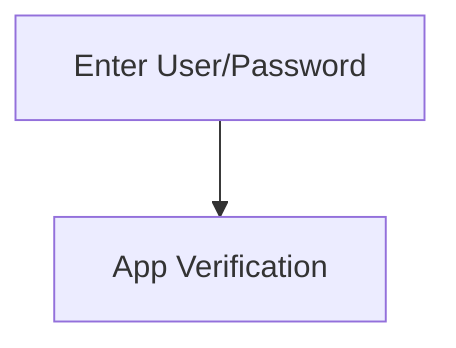

# Metadata
- Host/Service: `[[host/servicelink]]`
- Endpoints:
	- `[[endpoint1]]`
	- `[[endpoint2]]`
# Beschreibung
> [!NOTE] How To
> Beschreibung der Funktionalität, des Ablaufs mit entsprechenden Links zu Endpoints. Unbedingt auch `mermaid` Diagramme verwenden.

