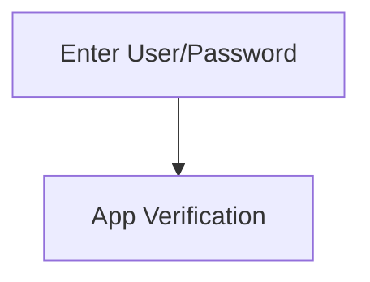

# Metadata
- Host/Service:  [[tmp-example-applikation]]
- Endpoints:
	- [[tmp-example-endpoint]]
# Beschreibung
> [!NOTE] How To
> Beschreibung der Funktionalität, des Ablaufs mit entsprechenden Links zu Endpoints. Unbedingt auch `mermaid` Diagramme verwenden.

